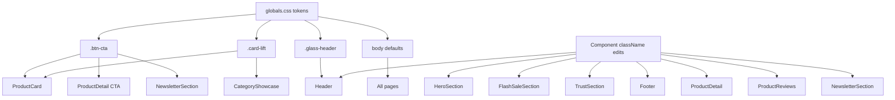

# Design Document: TechLaden Visual Redesign

## Overview

This document describes the technical design for migrating the TechLaden e-commerce store from its current dark, neon-accented aesthetic to a premium light theme. The redesign is purely visual — no data models, API routes, or business logic change. Every modification is confined to CSS custom properties, Tailwind utility classes, and JSX className strings across the component layer.

The single accent color is **Electric Tech Blue `#00A3E0`**, replacing the current cyan `#00F0FF`. Backgrounds shift from near-black (`#0A0A0A`, `#1A1A1A`) to white/off-white (`#FFFFFF`, `#FAFAFA`, `#F7F7F7`). Typography inverts from white-on-dark to dark-on-light (`#111111` / `#1A1A1A`).

All German text is preserved verbatim throughout.

---

## Architecture

The redesign follows a **token-first, component-second** approach:

1. **Phase 1 — Token Migration** (`globals.css` + `tailwind.config`): Update all CSS custom properties and shared utility classes. This is the single source of truth; components that already reference these tokens will update automatically.
2. **Phase 2 — Component Updates**: For components that hard-code dark colors in className strings (rather than using tokens), update those strings directly.



No new files are created. No routing, API, or state management changes are required.

---

## Components and Interfaces

### `src/app/globals.css`

The only structural change: update CSS custom property values and shared class rules.

| Class / Property | Current value | New value |
|---|---|---|
| `body` background | `#0A0A0A` | `#FFFFFF` |
| `body` color | `#FFFFFF` | `#111111` |
| `--accent` (new) | — | `#00A3E0` |
| `.btn-cta` background | `#00F0FF` | `#00A3E0` |
| `.btn-cta` color | `#000000` | `#FFFFFF` |
| `.btn-cta` box-shadow | cyan glow | blue glow `rgba(0,163,224,0.25)` |
| `.card-lift` background | `#1A1A1A` | `#FFFFFF` |
| `.card-lift` border | `rgba(255,255,255,0.05)` | `#E5E5E5` |
| `.card-lift:hover` shadow | dark + cyan | light + blue |
| `.glass-header` background | `rgba(10,10,10,0.7)` | `rgba(255,255,255,0.85)` |
| `.glass-header` border | `rgba(255,255,255,0.05)` | `rgba(0,0,0,0.08)` |

A new Tailwind utility `bg-surface-light` (`#F7F7F7`) is added via the `@layer utilities` block or `tailwind.config.ts` `extend.colors`.

### `tailwind.config.ts`

Add to `theme.extend.colors`:
```ts
accent: '#00A3E0',
'surface-light': '#F7F7F7',
```

### `src/components/layout/Header.tsx`

- `.glass-header` already applied — updates automatically from globals.css.
- Logo: `text-white` → `text-[#111111]`; accent span stays `text-primary` (now resolves to `#00A3E0`).
- Nav links: `text-text-secondary` → `text-[#555555]`; hover `hover:text-primary`.
- Active route link: `text-primary` (accent).
- Cart badge: `bg-primary` (accent) — already correct token, no change needed.
- Category dropdown: `bg-background` → `bg-white`; links `text-text-secondary hover:bg-surface` → `hover:bg-[#F7F7F7]`.
- Mobile menu panel: `bg-background` → `bg-white`; link text `text-white` → `text-[#111111]`.

### `src/components/home/HeroSection.tsx`

- Section: remove `bg-background` and the cyan glow `div`; add `bg-white`.
- `h1`: `text-white` → `text-[#111111]`; gradient span replaced with plain `text-accent` for "Das Beste für dein Smartphone."
- Body copy: `text-text-secondary` → `text-[#555555]`.
- CTA button: already uses `.btn-cta` — updates automatically.
- Trust badge icons: `text-success` → `text-accent` (or `text-[#00A3E0]`).
- Stats border: `border-border` → `border-[#E5E5E5]`; stat values `text-white` → `text-[#111111]`.
- Right column hero card: uses `.card-lift` — updates automatically. Inner text `text-white` → `text-[#111111]`.
- Lifestyle image: replace `picsum.photos` placeholder with a `<div>` styled `bg-[#F7F7F7]` containing descriptive alt text when no real URL is available (Requirement 3.7).

### `src/components/home/CategoryShowcase.tsx`

- Section background: remove purple glow; add `bg-white` or `bg-[#F7F7F7]`.
- Section heading: `text-white` → `text-[#111111]`; eyebrow `text-text-secondary` → `text-[#666666]`.
- Category cards: already use `.card-lift` (updates automatically) + `border-border` → `border-[#E5E5E5]`.
- Card name: `text-white group-hover:text-primary` → `text-[#111111] group-hover:text-accent`.
- Card desc: `text-text-secondary group-hover:text-white` → `text-[#666666] group-hover:text-[#111111]`.
- Add a minimal SVG icon per category above the name (inline SVG or lucide-react icon mapped per category name).

### `src/components/home/FlashSaleSection.tsx`

- Section: `bg-background` → `bg-white`; remove red glow div.
- Heading: `text-white` → `text-[#111111]`; "Nur heute" label stays `text-urgency` (red).
- Discount badge: already `bg-urgency text-white` — no change.
- Countdown timer: passes `dark` prop — update `CountdownTimer` to use `text-accent` for digit highlights in light mode.
- Product cards: `bg-surface border-border` → `bg-white border-[#E5E5E5]`; title `text-white` → `text-[#111111]`; price `text-white` → `text-[#111111]`; hover border stays `hover:border-urgency`.
- Grid: add `items-stretch` to ensure equal-height cards; inner content uses `flex flex-col h-full` with `mt-auto` on price block.

### `src/components/product/ProductCard.tsx`

- Already uses `.card-lift` and `.btn-cta` — both update automatically.
- Title: `text-white group-hover:text-primary` → `text-[#111111] group-hover:text-accent`.
- Price: `text-white` → `text-[#111111]`.
- Original price: `text-text-secondary` → `text-[#999999]`.
- Stars: `text-primary fill-primary` already resolves to accent — no change needed once token updates.
- Save badge: `bg-success text-black` → `bg-accent text-white` (Requirement 6.7).
- Sold badge: `bg-background/90 text-primary` → `bg-white/90 text-[#111111] border-[#E5E5E5]`.
- Out-of-stock overlay: `bg-background/80` → `bg-white/80`.

### `src/components/home/TrustSection.tsx`

- Section: `border-border bg-surface/50` → `border-[#E5E5E5] bg-[#F7F7F7]`.
- Add a lucide-react icon per trust item rendered in `text-accent`.
- Title: `text-white group-hover:text-primary` → `text-[#111111] font-bold`.
- Subtitle: `text-text-secondary` → `text-[#666666]`.
- Layout: already centered via `text-center`; add `flex flex-col items-center` per item.

### `src/components/layout/Footer.tsx`

- Footer wrapper: `bg-surface` → `bg-white`.
- Brand name: `text-white` → `text-[#111111]`; accent span stays `text-primary`.
- Column headings: `text-white` → `text-[#111111]`.
- Body/link text: `text-text-secondary` → `text-[#555555]`; hover `hover:text-primary` (accent).
- Bottom bar: `bg-background` → `bg-[#F7F7F7]`.
- Payment badges: `bg-surface border-border text-text-secondary` → `bg-white border-[#E5E5E5] text-[#111111]`.

### `src/components/product/ProductDetail.tsx`

- Page wrapper: `bg-background` → `bg-white`.
- Breadcrumb: `text-text-secondary` → `text-[#555555]`; hover `hover:text-accent`.
- Category label: already `text-primary` — resolves to accent.
- `h1`: `text-white` → `text-[#111111]`.
- Stars + sold: `text-white` → `text-[#111111]`; `text-text-secondary` → `text-[#555555]`; `bg-surface border-border` → `bg-[#F7F7F7] border-[#E5E5E5]`.
- Price block: `bg-surface border-border` → `bg-[#F7F7F7] border-[#E5E5E5]`; current price `text-primary` (accent); original price `text-text-secondary line-through` → `text-[#999999] line-through`; MwSt note `text-text-secondary` → `text-[#555555]`.
- Urgency bar: `bg-urgency/10 border-urgency/20` — keep as-is (red urgency preserved).
- Stock/visitors bar: `bg-surface/50 border-border` → `bg-[#F7F7F7] border-[#E5E5E5]`; text `text-white` → `text-[#111111]`.
- Color swatches: replace text-label pill buttons with rounded-square color-fill swatches (see Color Swatch section below).
- Model select: `bg-surface border-border text-white` → `bg-white border-[#E5E5E5] text-[#111111]`.
- CTA button: already `.btn-cta` — updates automatically. Label text: "In den Warenkorb" (German, preserved).
- Trust badges under CTA: icons `text-success` → `text-accent`; labels `text-text-secondary` → `text-[#111111]`.
- Accordion wrapper: `border-border bg-surface` → `border-[#E5E5E5] bg-[#F7F7F7]`.
- Accordion title: `text-white hover:text-primary` → `text-[#111111] hover:text-accent`.
- Accordion body: `text-text-secondary` → `text-[#555555]`.
- **USP Row** (new element, see below).
- Sticky mobile bar: `bg-surface/95 border-border` → `bg-white/95 border-[#E5E5E5]`; price `text-primary` (accent).
- USP Row placement: rendered after the accordion block, before the sticky mobile bar.

#### Color Swatch Sub-component

Replace the current pill-button color selector with a swatch grid:

```tsx
// Each swatch: 40×40px rounded-lg, background = color value (CSS color name or hex)
// Border: 2px solid #E5E5E5 (unselected) | 2px solid #00A3E0 + ring (selected)
// Label: text-xs text-[#111111] text-center below swatch
```

Color name → CSS color mapping is handled by a small lookup object. Unknown colors fall back to `bg-[#CCCCCC]`.

#### USP Row Sub-component

New inline component rendered inside `ProductDetail`:

```tsx
const USP_ITEMS = [
  { icon: Zap,         label: 'Schnellladung 22.5W' },
  { icon: Magnet,      label: 'MagSafe Kompatibel' },
  { icon: ShieldCheck, label: '1 Jahr Garantie' },
  { icon: Award,       label: 'CE & RoHS Zertifiziert' },
];
```

Layout: `grid grid-cols-2 lg:grid-cols-4 gap-4 bg-[#F7F7F7] border border-[#E5E5E5] rounded-xl p-4`. Each item: `flex flex-col items-center gap-2 text-center`. Icon: `text-accent w-6 h-6`. Label: `text-sm font-medium text-[#111111]`.

### `src/components/product/ProductReviews.tsx`

- Summary block: `bg-surface border-border` → `bg-[#F7F7F7] border-[#E5E5E5]`.
- Average rating number: `text-text-main` → `text-[#111111]`.
- Star icons: `text-yellow-400 fill-yellow-400` → `text-accent fill-accent` (Requirement 13.4). Rating bar fill: `bg-yellow-400` → `bg-accent`.
- Review cards: `border-border` → `border-[#E5E5E5]`.
- Reviewer name: `text-text-main` → `text-[#111111] font-semibold`.
- Review body: `text-text-secondary` → `text-[#555555]`.
- "Mehr anzeigen" button: `text-text-main hover:text-primary` → `text-[#111111] hover:text-accent`.

### `src/components/home/NewsletterSection.tsx`

- Section: `bg-background border-border` → `bg-[#F7F7F7] border-[#E5E5E5]`; remove glow divs.
- Eyebrow pill: `bg-primary/10 border-primary/20 text-primary` → `bg-accent/10 border-accent/20 text-accent`.
- Heading: `text-white` → `text-[#111111]`; gradient span → plain `text-accent`.
- Body copy: `text-text-secondary` → `text-[#555555]`.
- Email input: `bg-surface border-border text-white placeholder:text-text-secondary` → `bg-white border-[#E5E5E5] text-[#111111] placeholder:text-[#999999]`; focus `focus:border-accent`.
- Submit button: already `.btn-cta` — updates automatically.
- Success state: `bg-surface border-primary/30 text-primary` → `bg-white border-accent/30 text-accent`.
- Fine print: `text-text-secondary/60` → `text-[#999999]`.

---

## Data Models

No data model changes. The `Product`, `Review`, `Order`, and `User` types are unchanged. The redesign is purely presentational.

The only new "data" is the static `USP_ITEMS` array and the color-name-to-CSS-value lookup object, both defined inline in `ProductDetail.tsx`.

```ts
// Color name → CSS color value lookup (inline in ProductDetail.tsx)
const COLOR_MAP: Record<string, string> = {
  'Schwarz': '#111111',
  'Weiß': '#FFFFFF',
  'Silber': '#C0C0C0',
  'Gold': '#FFD700',
  'Blau': '#3B82F6',
  'Rot': '#EF4444',
  'Grün': '#22C55E',
  'Lila': '#A855F7',
  'Rosa': '#EC4899',
  'Grau': '#9CA3AF',
};
```

---

## Correctness Properties

*A property is a characteristic or behavior that should hold true across all valid executions of a system — essentially, a formal statement about what the system should do. Properties serve as the bridge between human-readable specifications and machine-verifiable correctness guarantees.*

This feature is primarily a UI/CSS redesign. Most acceptance criteria are visual rendering checks best covered by snapshot tests and example-based component tests. However, four universal properties emerge from the pure-function computation logic embedded in the components.

### Property 1: Price computation display consistency

*For any* product with a given EUR price, all derived display values — the formatted current price string, the formatted original (fake) price string, and the "Save X%" badge percentage — must match the values produced by the `fakeOriginalPrice` and percentage computation functions.

**Validates: Requirements 6.3, 6.4, 6.7, 9.6, 9.7**

### Property 2: Color swatch selection state

*For any* list of color variant strings and any selected color from that list, exactly the swatches whose color matches the selected value shall render with the Accent_Color border class, and all other swatches shall render with the light grey border class.

**Validates: Requirements 11.2, 11.3**

### Property 3: Out-of-stock CTA disabled

*For any* product where `inStock` is `false`, the "In den Warenkorb" CTA button shall be rendered with the `disabled` attribute and reduced opacity, regardless of other product properties.

**Validates: Requirements 12.5**

### Property 4: Review star fill count

*For any* review with an integer rating R between 1 and 5 inclusive, exactly R star icons shall be rendered with the filled/accent style, and exactly (5 − R) star icons shall be rendered with the unfilled style.

**Validates: Requirements 13.4**

---

## Error Handling

Since this is a visual redesign with no new async operations or data fetching:

- **Missing lifestyle image (Requirement 3.7)**: `HeroSection` renders a `<div className="bg-[#F7F7F7] rounded-[40px] flex items-center justify-center aspect-square">` with a descriptive `<p>` as fallback when no image URL is configured.
- **Unknown color variant name**: The `COLOR_MAP` lookup in `ProductDetail` falls back to `#CCCCCC` for any color name not in the map, ensuring the swatch always renders a visible color fill.
- **Missing product image**: Existing `"Kein Bild"` fallback text is updated to use `text-[#999999]` on a `bg-[#F7F7F7]` background for light-theme consistency.
- **Hydration**: All className changes are static strings — no hydration mismatch risk.

---

## Testing Strategy

### PBT Applicability Assessment

This feature is a UI/CSS redesign. The vast majority of acceptance criteria test visual rendering, CSS class application, and static content — none of which benefit from property-based testing with 100+ iterations. However, four pure-function computations embedded in the components (price formatting, swatch selection logic, stock state, star fill count) are suitable for property-based testing.

**PBT library**: [fast-check](https://github.com/dubzzz/fast-check) (TypeScript-native, works with Jest/Vitest).

### Unit / Snapshot Tests

For each component, a snapshot test verifies the rendered output matches the expected light-theme markup:

- `globals.css` token values (parsed CSS assertions)
- `Header` — default state, mobile open, dropdown open, active route
- `HeroSection` — default render, placeholder fallback (no image)
- `CategoryShowcase` — card render, hover class presence
- `FlashSaleSection` — with products, empty state
- `ProductCard` — in-stock, out-of-stock
- `TrustSection` — all 5 items rendered with icons
- `Footer` — full render, payment badges
- `ProductDetail` — price block, USP row, color swatches (selected/unselected), CTA states
- `ProductReviews` — summary block, individual review card
- `NewsletterSection` — default, success state

### Property-Based Tests

Each property test uses `fast-check` with a minimum of 100 iterations.

**Property 1 — Price computation display consistency**
```
// Feature: techladen-visual-redesign, Property 1: price computation display consistency
fc.assert(fc.property(
  fc.float({ min: 1, max: 999, noNaN: true }),
  (price) => {
    const original = fakeOriginalPrice(price);
    const pct = Math.round(((original - price) / original) * 100);
    const rendered = renderProductCard({ price: { eur: price }, ... });
    expect(rendered).toContain(price.toFixed(2).replace('.', ','));
    expect(rendered).toContain(original.toFixed(2).replace('.', ','));
    expect(rendered).toContain(`Save ${pct}%`);
  }
), { numRuns: 100 });
```

**Property 2 — Color swatch selection state**
```
// Feature: techladen-visual-redesign, Property 2: color swatch selection state
fc.assert(fc.property(
  fc.array(fc.string({ minLength: 1 }), { minLength: 1, maxLength: 10 }),
  fc.nat(),
  (colors, idx) => {
    const selected = colors[idx % colors.length];
    const swatches = renderSwatches(colors, selected);
    swatches.forEach((swatch, i) => {
      if (colors[i] === selected) {
        expect(swatch).toHaveClass('border-accent');
      } else {
        expect(swatch).not.toHaveClass('border-accent');
      }
    });
  }
), { numRuns: 100 });
```

**Property 3 — Out-of-stock CTA disabled**
```
// Feature: techladen-visual-redesign, Property 3: out-of-stock CTA disabled
fc.assert(fc.property(
  fc.record({ ...productArbitrary, inStock: fc.constant(false) }),
  (product) => {
    const button = renderCTAButton(product);
    expect(button).toBeDisabled();
    expect(button).toHaveClass('opacity-40');
  }
), { numRuns: 100 });
```

**Property 4 — Review star fill count**
```
// Feature: techladen-visual-redesign, Property 4: review star fill count
fc.assert(fc.property(
  fc.integer({ min: 1, max: 5 }),
  (rating) => {
    const stars = renderStarRow(rating);
    const filled = stars.filter(s => s.hasClass('fill-accent')).length;
    const empty  = stars.filter(s => s.hasClass('fill-gray-200')).length;
    expect(filled).toBe(rating);
    expect(empty).toBe(5 - rating);
  }
), { numRuns: 100 });
```

### Integration / Visual Regression

- Run `next build` to confirm no TypeScript or JSX errors after all className changes.
- Manual browser review of homepage and product detail page in light mode.
- Optional: Playwright visual snapshot of `/` and `/[slug]` routes for regression baseline.
